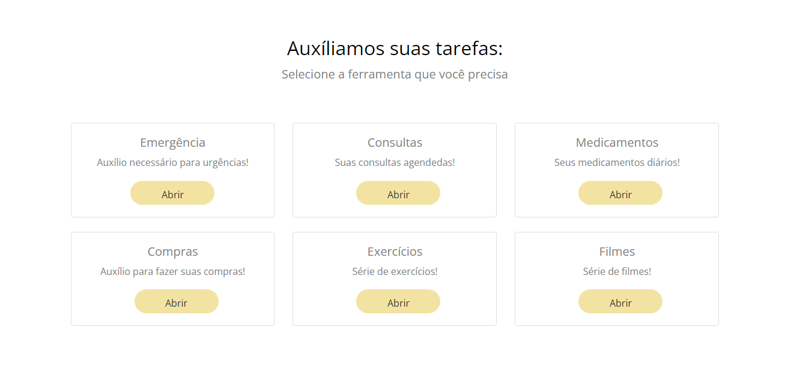
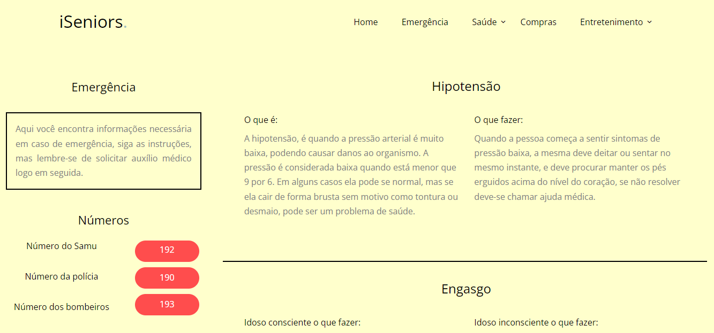
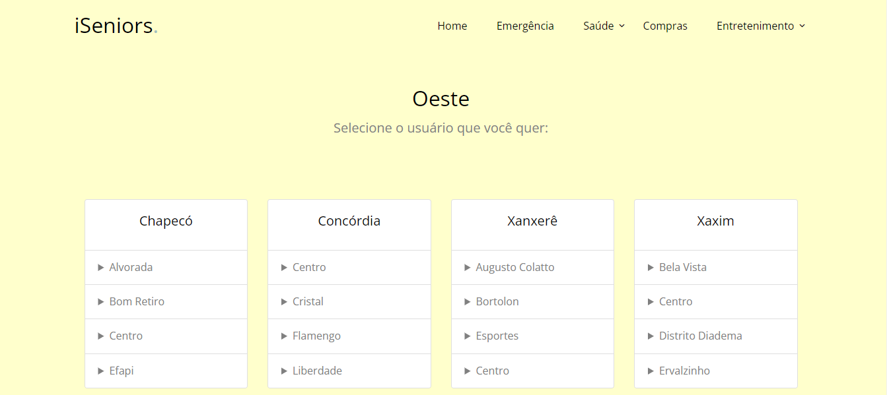

# iSeniors
> Trabalho desenvolvido para projeto da Trilha Digital do Senai, para auxiliar os idosos neste momento de pandemia.






## Installation

Web:

```sh
Abra o index.html
```

## Exemplo de uso
Auxílio para idosos

## Setup de desenvolvimento

```sh
Abra  no Visual Studio Code e rode com a extensão live reload
```

## Release History
* 0.0.1
    * The first proper release
    * Work in progress

## Meta
Emelly Becker  – emellyvbecker@gmail.com

[https://github.com/EmellyVBecker/iSeniors](https://github.com/EmellyVBecker)

## Contributing

1. Fork it (<https://github.com/EmellyVBecker/iSeniors/fork>)
2. Create your feature branch (`git checkout -b feature/fooBar`)
3. Commit your changes (`git commit -am 'Add some fooBar'`)
4. Push to the branch (`git push origin feature/fooBar`)
5. Create a new Pull Request

